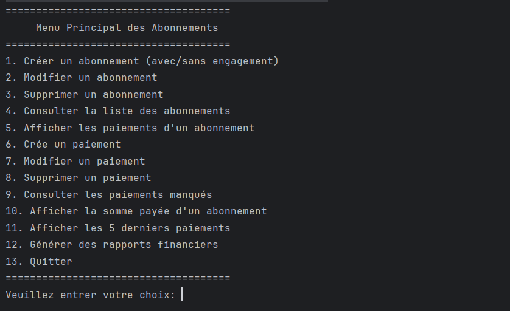
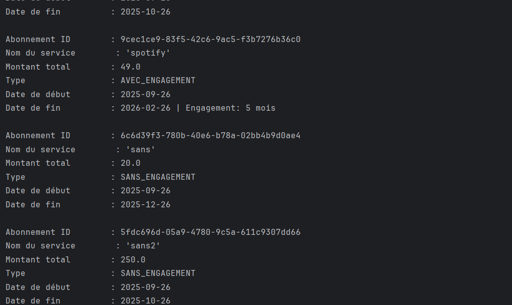
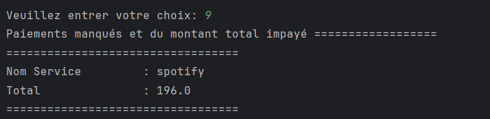
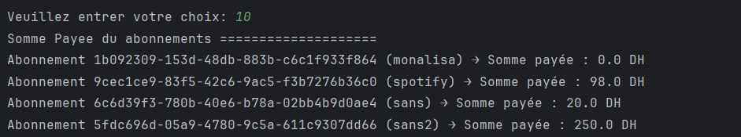
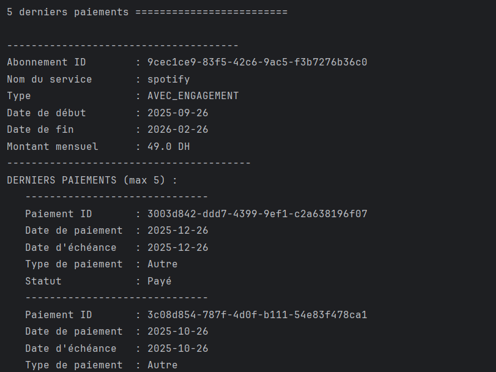
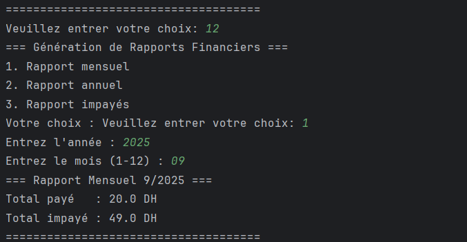
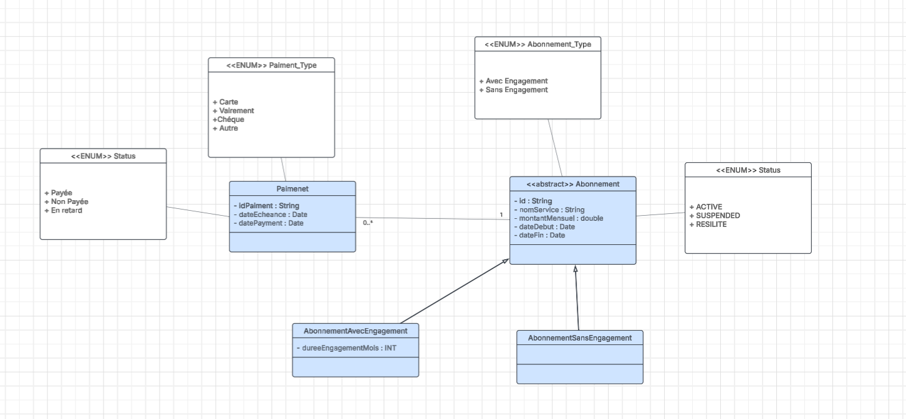
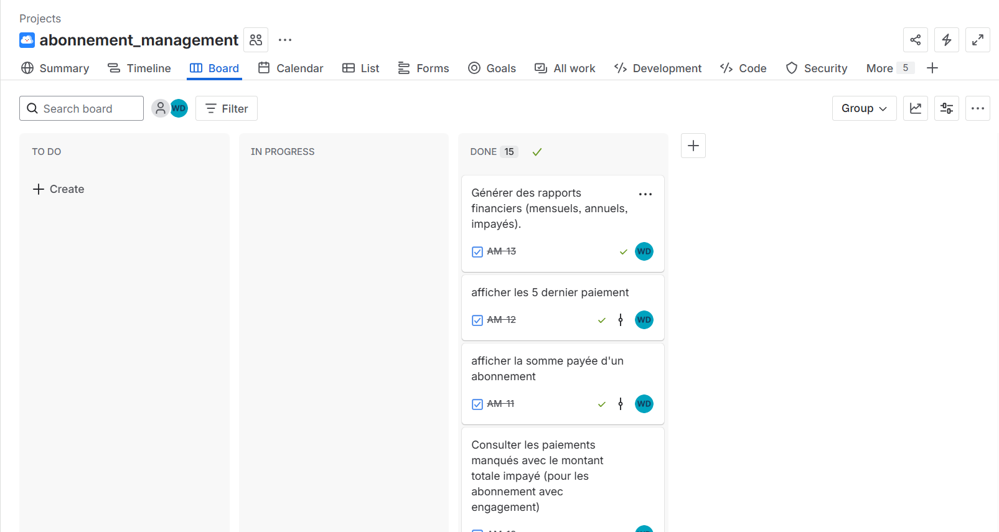

# Gestion des Abonnements

## Contexte du projet

La gestion des abonnements, qu'ils soient personnels (streaming, musique, assurances, services mobiles) ou professionnels (logiciels, outils collaboratifs, services cloud), est devenue une tâche quotidienne complexe. L’accumulation des dates d’échéance, la difficulté à détecter les paiements manqués et le suivi du budget rendent la gestion difficile pour les particuliers comme pour les responsables financiers.

Cette application vise à centraliser la gestion des abonnements, suivre les échéances, détecter rapidement les paiements manqués et générer des rapports synthétiques pour évaluer le coût réel et prévisionnel.

---

## Objectifs du projet

- Centraliser la gestion des abonnements personnels et professionnels.
- Suivre les échéances et paiements.
- Détecter les impayés et générer des alertes.
- Produire des rapports financiers mensuels et annuels.
- Offrir une interface console intuitive pour faciliter la navigation et la gestion.

---

## Architecture de l’application

L’application est conçue selon une architecture en couches pour garantir la séparation des responsabilités :

- **Couche Présentation (UI/Menu)** : Interface textuelle (console) permettant la navigation et l'interaction avec l'utilisateur.
- **Couche Métier (Services)** : Logique applicative (génération d’échéances, détection des impayés, rapports financiers).
- **Couche Entity** : Représentation des objets métiers persistants (`Abonnement`, `Paiement`).
- **Couche DAO** : Persistance via JDBC et base relationnelle (PostgreSQL ou MySQL), communication avec la base de données.
- **Couche Utilitaire** : Gestion des dates, formatage, validations.

---

## Structure et contenu des classes

### Couche Entity

- **Abonnement** (classe abstraite)
    - Attributs : `id` (UUID), `nomService`, `montantMensuel`, `dateDebut`, `dateFin`, `statut` (enum : Active, Suspendu, Résilié)
- **AbonnementAvecEngagement** (hérite de Abonnement)
    - Attribut supplémentaire : `dureeEngagementMois`
- **AbonnementSansEngagement** (hérite de Abonnement)
    - Pas d’attribut supplémentaire
- **Paiement**
    - Attributs : `idPaiement` (UUID), `idAbonnement`, `dateEcheance`, `datePaiement`, `typePaiement`, `statut` (enum : payé, non payé, en retard)

### Couche Services

- **AbonnementService** : Création, modification, suppression, résiliation, génération d’échéance
- **PaiementService** : Enregistrement, modification, suppression, détection des impayés, génération des rapports financiers

### Couche DAO (via JDBC)

- **AbonnementDAO** : `create`, `findById`, `findAll`, `update`, `delete`, `findActiveSubscriptions`, `findByType`
- **PaiementDAO** : `create`, `findById`, `findByAbonnement`, `findAll`, `update`, `delete`, `findUnpaidByAbonnement`, `findLastPayments`

---

## Base de données

### Tables principales

- **Abonnement** : (`id`, `nomService`, `montantMensuel`, `dateDebut`, `dateFin`, `statut`, `typeAbonnement`, `dureeEngagementMois`)
- **Paiement** : (`idPaiement`, `idAbonnement`, `dateEcheance`, `datePaiement`, `typePaiement`, `statut`)

**Contraintes** :
- Relation 1..n entre Abonnement et Paiement

---

## Fonctionnalités de l’interface utilisateur (console)

- Créer des abonnements (avec/sans engagement)
- Modifier, supprimer un abonnement
- Consulter la liste des abonnements
- Afficher les paiements d’un abonnement
- Enregistrer un paiement
- Modifier, supprimer un paiement
- Consulter les paiements manqués avec le montant total impayé (pour les abonnements avec engagement)
- Afficher la somme payée d’un abonnement
- Afficher les 5 derniers paiements
- Générer des rapports financiers (mensuels, annuels, impayés)

---

## Exigences techniques

- Application console en Java 8
- Programmation fonctionnelle : Stream API, lambda, Optional, Collectors
- Génération automatique des échéances
- Détection des impayés
- Rapports financiers avec Streams et Collectors
- Persistance via JDBC (PostgreSQL/MySQL)
- Architecture en couches (UI, services métier, DAO/repository, utilitaires)
- Gestion des exceptions (try/catch + messages clairs)
- Contrôle de version avec Git

---

## Démarrage rapide

1. **Cloner le projet**
   ```bash
   git clone https://github.com/WissamDouskary/Abonnement-management.git
   ```

2. **Configurer la base de données**
    - Créer une base PostgreSQL ou MySQL
    - Adapter le fichier de configuration JDBC (`src/main/resources/db.properties`)

3. **Compiler et exécuter**
   ```bash
   mvn clean package
   java -jar target/Abonnement-management.jar
   ```
   ou via IDE (IntelliJ, Eclipse...)

---

## Contributions

Les contributions sont les bienvenues !  
Merci d’ouvrir une issue ou une pull request pour toute suggestion ou amélioration.

---

## Application Images



---



---



---



---



---



---

## Class Diagram 



---

## Planification Jira




## Licence

Ce projet est sous licence MIT.